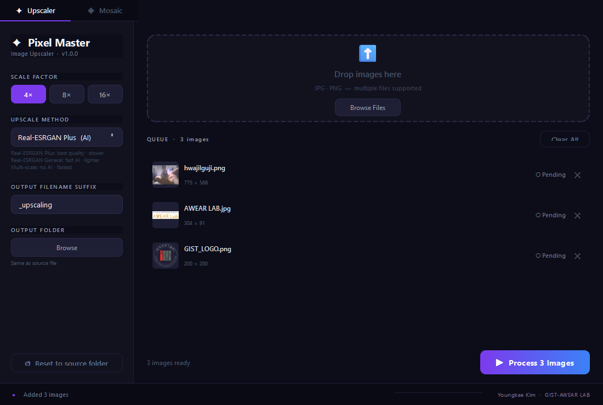
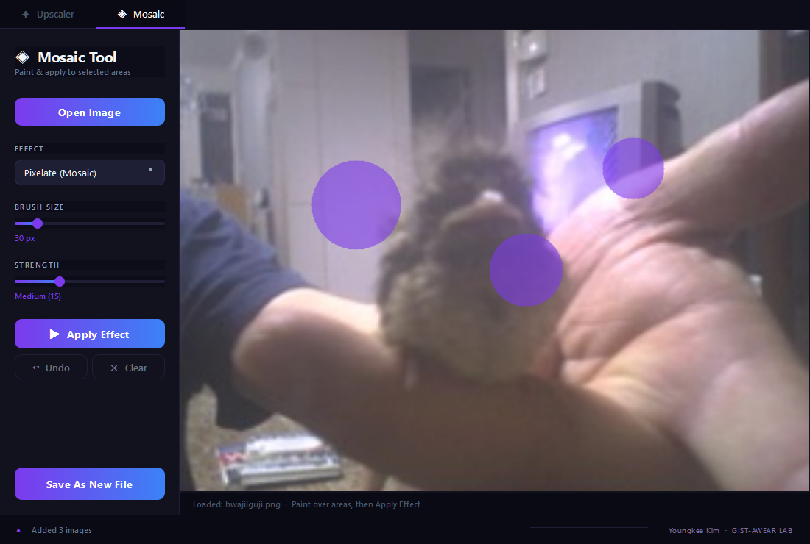
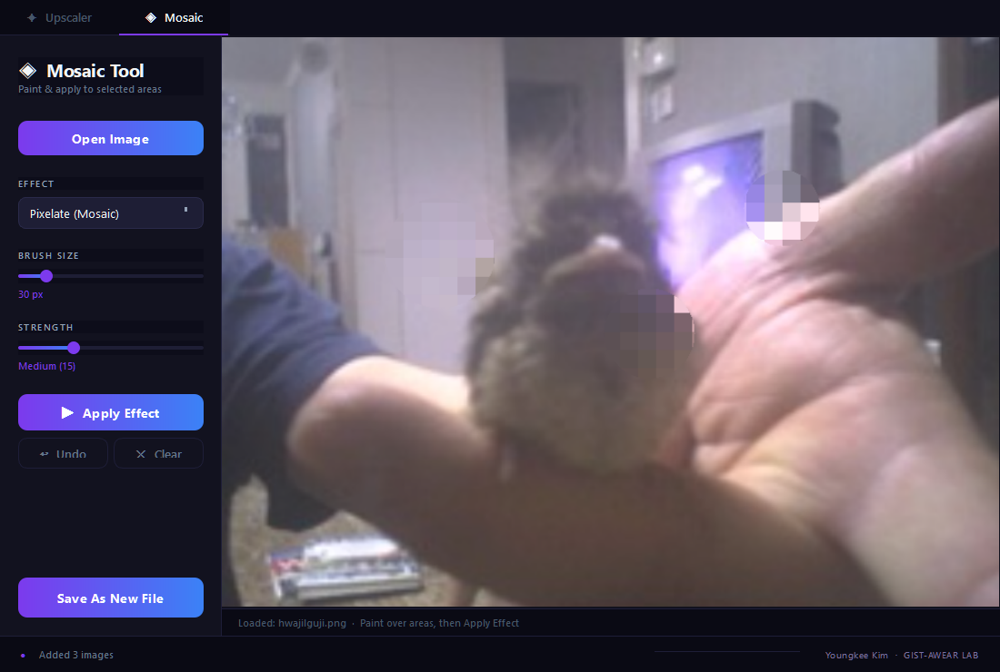
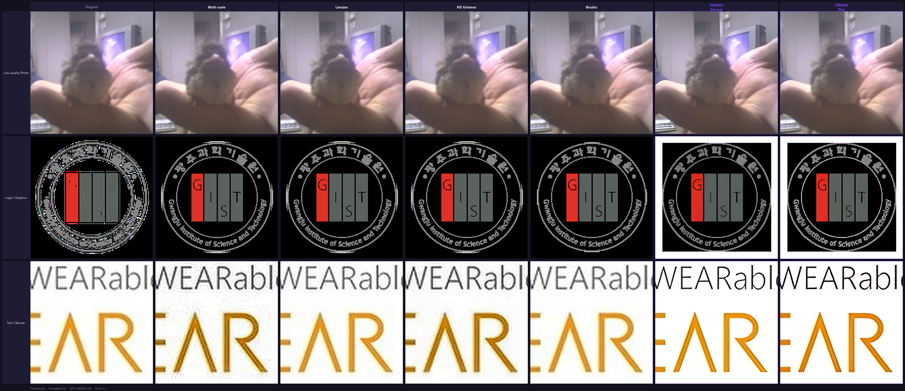

<div align="center">


# PixelMaster

**AI-powered image upscaler & mosaic tool — one-click Windows app, no install required.**

[](https://github.com/everise98/PixelMaster/releases)
[](https://github.com/everise98/PixelMaster/releases)
[](https://python.org)
[](https://pypi.org/project/PyQt6/)
[](LICENSE)

<br/>



</div>

---

## ✦ Features

| Feature | Details |
|---|---|
| **AI Upscaling** | Real-ESRGAN Plus & General (ONNX, CPU) |
| **Classic Methods** | Multi-scale, Lanczos, HD Enhance, Bicubic |
| **Scale Factors** | 4× · 8× · 16× |
| **Mosaic Tool** | Freehand brush → Pixelate or Gaussian Blur |
| **Batch Processing** | Drag & drop multiple files at once |
| **Before/After Preview** | Split-view comparison before saving |
| **No Installation** | Single `.exe`, no Python or GPU required |

---

## ⬇ Download

> **No installation required.** Just download and double-click.

1. Go to the [**Releases**](https://github.com/everise98/PixelMaster/releases) page
2. Download `PixelMaster.exe` from the latest release
3. Double-click to run — Windows may show a SmartScreen warning, click **More info → Run anyway**

```
PixelMaster.exe   (~165 MB, includes AI models)
```

---

## 🚀 Quick Start

### Upscaler


**Step 1 — Add Images**
Drag & drop JPG / PNG files onto the drop zone, or click **Browse Files**.
Multiple files are supported.

**Step 2 — Configure**

| Setting | Description |
|---|---|
| **Scale Factor** | `4×` `8×` `16×` — how much to enlarge the image |
| **Upscale Method** | Choose algorithm (see [Methods](#-upscale-methods) below) |
| **Output Suffix** | Appended to filename, e.g. `photo_upscaling.jpg` |
| **Output Folder** | Defaults to same folder as source file |

**Step 3 — Process**
Click **▶ Process Images**.
A before/after preview dialog appears for each image — click **Save** to keep or **Skip** to discard.

---

### ◈ Mosaic Tool

<table>
<tr>
<td></td>
<td></td>
</tr>
<tr>
<td align="center"><sub>Paint areas with the brush</sub></td>
<td align="center"><sub>Apply Pixelate or Blur</sub></td>
</tr>
</table>

**Step 1 — Open Image**
Click the **Mosaic** tab at the top. Then click **Open Image** or drag & drop a file onto the canvas.

**Step 2 — Paint**
Hold and drag the mouse over any area to mark it with the purple brush.
Adjust **Brush Size** with the slider.

**Step 3 — Choose Effect & Apply**

| Effect | Best For |
|---|---|
| **Pixelate (Mosaic)** | Faces, license plates, sensitive text |
| **Gaussian Blur** | Soft, natural-looking redaction |

Adjust **Strength** then click **▶ Apply Effect**.
Repeat on different areas as needed.

**Step 4 — Save**
Click **Save As New File** — saved as `original_mosaic.png` (new file, original untouched).

> **Tip:** Press `Ctrl+Z` or click **↩ Undo** to revert the last Apply. **✕ Clear** resets the painted mask without applying.

---

## 🔬 Upscale Methods



<sub>4× upscale comparison — Left: Original (nearest-neighbor enlarged) · Center: Real-ESRGAN General · Right: Real-ESRGAN Plus</sub>

<br/>

| Method | Speed | Quality | Best For |
|---|---|---|---|
| **Real-ESRGAN General** ⭐ | Medium | ★★★★☆ | General images, best speed/quality balance |
| **Real-ESRGAN Plus** | Slow | ★★★★★ | Photos, faces, maximum detail |
| **Multi-scale** | Fast | ★★★☆☆ | Balanced, no AI |
| **HD Enhance** | Fast | ★★★☆☆ | Slightly noisy photos |
| **Lanczos** | Fast | ★★★☆☆ | Clean edges |
| **Bicubic** | Fastest | ★★☆☆☆ | Smooth upscale, minimal sharpening |

> Real-ESRGAN models run entirely on CPU — no GPU required.
> Plus model is slower (~2–8 min depending on image size) but produces the best results.

---

## 🛠 Build from Source

```bash
git clone https://github.com/everise98/PixelMaster.git
cd PixelMaster

python -m venv venv
venv\Scripts\activate
pip install PyQt6 Pillow opencv-python onnxruntime pyinstaller

# Run directly
python main.py

# Build exe
pyinstaller pixelrevive.spec --noconfirm
# Output: dist/PixelMaster.exe
```

> ONNX model files (`assets/models/*.onnx`) are required.
> Download from [Releases](https://github.com/everise98/PixelMaster/releases) or convert from original `.pth` weights using `convert_models.py`.

---

## 📁 Project Structure

```
PixelMaster/
├── main.py                   # Entry point
├── assets/
│   ├── icon.ico
│   └── models/
│       ├── RealESRGAN_x4plus.onnx        (67 MB)
│       └── realesr-general-x4v3.onnx     (5 MB)
├── src/
│   ├── core/
│   │   ├── upscaler.py       # All upscaling algorithms
│   │   └── worker.py         # QThread worker
│   └── ui/
│       ├── main_window.py
│       ├── mosaic_tab.py     # Mosaic tool
│       ├── preview_dialog.py # Before/after slider
│       ├── image_card.py
│       ├── drop_zone.py
│       └── styles.py
└── pixelrevive.spec          # PyInstaller config
```

---

## 📄 License

MIT License — free to use, modify, and distribute.

---

<div align="center">

Made by **Youngkee Kim**

</div>
